# EZ Eatin' Infrastructure Architecture & Deployment Strategy

## Overview

This document outlines the complete infrastructure architecture for deploying EZ Eatin' to production using Render as the primary hosting platform with GitHub integration for CI/CD.

## Infrastructure Architecture

### High-Level Architecture Diagram


### Component Architecture


## Render Deployment Architecture

### Service Configuration

#### Frontend Service (Static Site)
```yaml
# Render Static Site Configuration
name: ezeatin-frontend
type: static_site
build_command: npm ci && npm run build
publish_directory: ./dist
auto_deploy: true
branch: main
root_directory: frontend

# Environment Variables
environment_variables:
  - VITE_API_BASE_URL: https://ezeatin-backend.onrender.com/api/v1
  - VITE_APP_ENV: production
  - NODE_VERSION: 18

# Custom Headers for Security
headers:
  - path: /*
    name: X-Frame-Options
    value: DENY
  - path: /*
    name: X-Content-Type-Options
    value: nosniff
  - path: /*
    name: Strict-Transport-Security
    value: max-age=31536000; includeSubDomains
  - path: /assets/*
    name: Cache-Control
    value: public, max-age=31536000, immutable

# SPA Routing
routes:
  - type: rewrite
    source: /*
    destination: /index.html
```

#### Backend Service (Web Service)
```yaml
# Render Web Service Configuration
name: ezeatin-backend
type: web_service
runtime: python
build_command: pip install -r requirements.txt
start_command: python main.py
auto_deploy: true
branch: main
root_directory: backend

# Environment Variables (Set in Render Dashboard)
environment_variables:
  - APP_ENV: production
  - PORT: 10000
  - PYTHON_VERSION: 3.11.0
  - MONGODB_URI: [SECRET]
  - JWT_SECRET: [SECRET]
  - CORS_ORIGINS: https://ezeatin-frontend.onrender.com

# Health Check Configuration
health_check_path: /healthz
health_check_timeout: 30
health_check_interval: 30
health_check_grace_period: 60

# Auto-scaling Configuration
instance_count: 1
max_instances: 3
cpu_threshold: 70
memory_threshold: 80
```

### Deployment Pipeline Architecture

```mermaid
graph TD
    subgraph "Development Workflow"
        DEV_BRANCH[🔧 Feature Branch<br/>Local Development]
        PR[📝 Pull Request<br/>Code Review]
        MAIN_BRANCH[🌟 Main Branch<br/>Production Ready]
    end
    
    subgraph "CI/CD Pipeline"
        GITHUB_ACTIONS[⚡ GitHub Actions<br/>Automated Testing]
        BUILD_TEST[🧪 Build & Test<br/>Frontend + Backend]
        SECURITY_SCAN[🔒 Security Scan<br/>Dependency Check]
        DEPLOY_TRIGGER[🚀 Deploy Trigger<br/>Auto-deployment]
    end
    
    subgraph "Render Deployment"
        BUILD_FRONTEND[📦 Build Frontend<br/>Vite Production Build]
        BUILD_BACKEND[🐍 Build Backend<br/>Python Dependencies]
        DEPLOY_FRONTEND[🌐 Deploy Frontend<br/>Static Site Update]
        DEPLOY_BACKEND[⚙️ Deploy Backend<br/>Web Service Update]
    end
    
    subgraph "Production Environment"
        LIVE_FRONTEND[✅ Live Frontend<br/>CDN Distribution]
        LIVE_BACKEND[✅ Live Backend<br/>Auto-scaling Ready]
        HEALTH_MONITORING[📊 Health Monitoring<br/>Uptime Tracking]
    end
    
    DEV_BRANCH --> PR
    PR --> MAIN_BRANCH
    MAIN_BRANCH --> GITHUB_ACTIONS
    GITHUB_ACTIONS --> BUILD_TEST
    BUILD_TEST --> SECURITY_SCAN
    SECURITY_SCAN --> DEPLOY_TRIGGER
    DEPLOY_TRIGGER --> BUILD_FRONTEND
    DEPLOY_TRIGGER --> BUILD_BACKEND
    BUILD_FRONTEND --> DEPLOY_FRONTEND
    BUILD_BACKEND --> DEPLOY_BACKEND
    DEPLOY_FRONTEND --> LIVE_FRONTEND
    DEPLOY_BACKEND --> LIVE_BACKEND
    LIVE_FRONTEND --> HEALTH_MONITORING
    LIVE_BACKEND --> HEALTH_MONITORING
```



## Database Architecture Strategy

### MongoDB Atlas Production Setup

#### Cluster Configuration
```javascript
// MongoDB Atlas M10 Production Cluster
{
  "clusterType": "REPLICASET",
  "name": "EZEatin-Production",
  "mongoDBMajorVersion": "7.0",
  "clusterTier": "M10",
  "regionConfigs": [
    {
      "regionName": "US_EAST_1",
      "priority": 7,
      "providerName": "AWS",
      "electableNodes": 3,
      "readOnlyNodes": 0,
      "analyticsNodes": 0
    }
  ],
  "backupEnabled": true,
  "pitEnabled": true,
  "encryptionAtRestProvider": "AWS"
}
```

#### Database Schema Design
```javascript
// Production Database Collections
{
  "databases": [
    {
      "name": "ez_eatin_prod",
      "collections": [
        {
          "name": "users",
          "indexes": [
            { "email": 1, "unique": true },
            { "created_at": 1 }
          ]
        },
        {
          "name": "profiles",
          "indexes": [
            { "user_id": 1, "unique": true },
            { "user_id": 1, "family_members.id": 1 }
          ]
        },
        {
          "name": "pantry_items",
          "indexes": [
            { "user_id": 1, "category": 1 },
            { "user_id": 1, "expiration_date": 1 },
            { "user_id": 1, "created_at": -1 }
          ]
        },
        {
          "name": "recipes",
          "indexes": [
            { "user_id": 1 },
            { "tags": 1 },
            { "difficulty": 1, "prep_time": 1 }
          ]
        },
        {
          "name": "community_posts",
          "indexes": [
            { "user_id": 1, "created_at": -1 },
            { "post_type": 1, "is_public": 1 },
            { "tags": 1 }
          ]
        }
      ]
    }
  ]
}
```

#### Connection Pool Configuration
```python
# Production MongoDB Connection Settings
MONGODB_SETTINGS = {
    "maxPoolSize": 50,
    "minPoolSize": 5,
    "maxIdleTimeMS": 30000,
    "waitQueueTimeoutMS": 5000,
    "serverSelectionTimeoutMS": 5000,
    "socketTimeoutMS": 20000,
    "connectTimeoutMS": 10000,
    "retryWrites": True,
    "w": "majority",
    "readPreference": "primary",
    "readConcern": {"level": "majority"},
    "writeConcern": {"w": "majority", "j": True}
}
```

## Security Architecture

### Network Security

```mermaid
graph TB
    subgraph "Security Layers"
        HTTPS[🔒 HTTPS/TLS 1.3<br/>End-to-end Encryption]
        CORS[🛡️ CORS Policy<br/>Origin Validation]
        HEADERS[📋 Security Headers<br/>XSS, CSRF Protection]
        RATE_LIMIT[⏱️ Rate Limiting<br/>DDoS Protection]
    end
    
    subgraph "Authentication & Authorization"
        JWT[🎫 JWT Tokens<br/>Stateless Auth]
        RBAC[👤 Role-Based Access<br/>User Permissions]
        SESSION[⏰ Session Management<br/>Token Expiration]
    end
    
    subgraph "Data Security"
        ENCRYPTION[🔐 Data Encryption<br/>At Rest & In Transit]
        SECRETS[🗝️ Secret Management<br/>Environment Variables]
        BACKUP[💾 Secure Backups<br/>Encrypted Storage]
    end
    
    HTTPS --> CORS
    CORS --> HEADERS
    HEADERS --> RATE_LIMIT
    JWT --> RBAC
    RBAC --> SESSION
    ENCRYPTION --> SECRETS
    SECRETS --> BACKUP
```


### Security Configuration Matrix

| Component | Security Measure | Implementation |
|-----------|------------------|----------------|
| **Frontend** | HTTPS Enforcement | Render automatic SSL |
| **Frontend** | Security Headers | CSP, HSTS, X-Frame-Options |
| **Frontend** | Content Security | XSS protection, CSRF tokens |
| **Backend** | API Authentication | JWT with HS256 algorithm |
| **Backend** | Rate Limiting | 100 requests/minute per IP |
| **Backend** | Input Validation | Pydantic models, sanitization |
| **Database** | Network Security | IP whitelist, VPC peering |
| **Database** | Encryption | TLS 1.2+, encryption at rest |
| **Database** | Access Control | Database user permissions |

## Performance & Scaling Strategy

### Frontend Performance Optimization

```typescript
// Production Build Optimizations
export default defineConfig({
  build: {
    target: 'es2020',
    minify: 'terser',
    sourcemap: false,
    rollupOptions: {
      output: {
        manualChunks: {
          'vendor': ['react', 'react-dom'],
          'ui': ['@radix-ui/react-dialog', '@radix-ui/react-dropdown-menu'],
          'utils': ['date-fns', 'clsx', 'tailwind-merge']
        }
      }
    },
    chunkSizeWarningLimit: 1000
  }
});
```

### Backend Performance Configuration

```python
# Production Server Configuration
UVICORN_CONFIG = {
    "host": "0.0.0.0",
    "port": int(os.getenv("PORT", 10000)),
    "workers": 4,  # CPU cores * 2
    "worker_class": "uvicorn.workers.UvicornWorker",
    "max_requests": 1000,
    "max_requests_jitter": 100,
    "timeout": 30,
    "keepalive": 5,
    "access_log": True,
    "log_level": "info"
}
```

### Auto-scaling Configuration

```yaml
# Render Auto-scaling Rules
scaling:
  min_instances: 1
  max_instances: 5
  target_cpu_utilization: 70
  target_memory_utilization: 80
  scale_up_cooldown: 300  # 5 minutes
  scale_down_cooldown: 600  # 10 minutes
  
health_checks:
  path: /healthz
  interval: 30
  timeout: 10
  healthy_threshold: 2
  unhealthy_threshold: 3
```

## Monitoring & Observability

### Application Monitoring Stack

```mermaid
graph TB
    subgraph "Monitoring Sources"
        APP_LOGS[📝 Application Logs<br/>Structured JSON Logging]
        METRICS[📊 Application Metrics<br/>Response Times, Errors]
        HEALTH[💚 Health Checks<br/>System Status]
    end
    
    subgraph "Render Platform"
        RENDER_LOGS[📋 Render Logs<br/>Platform Events]
        RENDER_METRICS[📈 Render Metrics<br/>CPU, Memory, Network]
        RENDER_ALERTS[🚨 Render Alerts<br/>Service Notifications]
    end
    
    subgraph "External Monitoring"
        UPTIME[⏰ Uptime Monitoring<br/>External Health Checks]
        ERROR_TRACKING[🐛 Error Tracking<br/>Sentry Integration]
        ANALYTICS[📊 User Analytics<br/>Usage Patterns]
    end
    
    APP_LOGS --> RENDER_LOGS
    METRICS --> RENDER_METRICS
    HEALTH --> RENDER_ALERTS
    RENDER_ALERTS --> UPTIME
    APP_LOGS --> ERROR_TRACKING
    METRICS --> ANALYTICS
```



### Logging Configuration

```python
# Production Logging Setup
import logging
import json
from datetime import datetime

class JSONFormatter(logging.Formatter):
    def format(self, record):
        log_entry = {
            "timestamp": datetime.utcnow().isoformat(),
            "level": record.levelname,
            "logger": record.name,
            "message": record.getMessage(),
            "module": record.module,
            "function": record.funcName,
            "line": record.lineno
        }
        
        if hasattr(record, 'user_id'):
            log_entry['user_id'] = record.user_id
        if hasattr(record, 'request_id'):
            log_entry['request_id'] = record.request_id
            
        return json.dumps(log_entry)

# Configure production logging
logging.basicConfig(
    level=logging.INFO,
    handlers=[logging.StreamHandler()],
    format='%(message)s'
)

for handler in logging.root.handlers:
    handler.setFormatter(JSONFormatter())
```

### Health Check Implementation

```python
# Comprehensive Health Check Endpoint
@app.get("/healthz")
async def health_check():
    """Production health check with detailed diagnostics"""
    start_time = time.time()
    
    health_status = {
        "status": "healthy",
        "timestamp": datetime.utcnow().isoformat(),
        "version": "1.0.0",
        "environment": os.getenv("APP_ENV"),
        "checks": {}
    }
    
    # Database connectivity check
    try:
        await db.database.command("ping")
        health_status["checks"]["database"] = {
            "status": "healthy",
            "response_time": time.time() - start_time
        }
    except Exception as e:
        health_status["checks"]["database"] = {
            "status": "unhealthy",
            "error": str(e)
        }
        health_status["status"] = "degraded"
    
    # Memory usage check
    import psutil
    memory_percent = psutil.virtual_memory().percent
    health_status["checks"]["memory"] = {
        "status": "healthy" if memory_percent < 85 else "warning",
        "usage_percent": memory_percent
    }
    
    # Disk usage check
    disk_percent = psutil.disk_usage('/').percent
    health_status["checks"]["disk"] = {
        "status": "healthy" if disk_percent < 90 else "warning",
        "usage_percent": disk_percent
    }
    
    health_status["response_time"] = time.time() - start_time
    
    return health_status
```

## Disaster Recovery & Business Continuity

### Backup Strategy

```mermaid
graph TB
    subgraph "Backup Sources"
        DB_PRIMARY[(🍃 Primary Database<br/>MongoDB Atlas)]
        APP_CODE[📦 Application Code<br/>GitHub Repository]
        CONFIG[⚙️ Configuration<br/>Environment Variables)]
    end
    
    subgraph "Backup Storage"
        DB_BACKUP[(💾 Database Backups<br/>Point-in-time Recovery)]
        CODE_BACKUP[📋 Code Backups<br/>Git History + Releases)]
        CONFIG_BACKUP[🗂️ Config Backups<br/>Documentation)]
    end
    
    subgraph "Recovery Procedures"
        DB_RESTORE[🔄 Database Restore<br/>Automated Recovery)]
        APP_REDEPLOY[🚀 Application Redeploy<br/>GitHub Actions)]
        CONFIG_RESTORE[⚡ Config Restore<br/>Environment Setup)]
    end
    
    DB_PRIMARY --> DB_BACKUP
    APP_CODE --> CODE_BACKUP
    CONFIG --> CONFIG_BACKUP
    
    DB_BACKUP --> DB_RESTORE
    CODE_BACKUP --> APP_REDEPLOY
    CONFIG_BACKUP --> CONFIG_RESTORE
```

### Recovery Time Objectives (RTO) & Recovery Point Objectives (RPO)

| Component | RTO Target | RPO Target | Recovery Method |
|-----------|------------|------------|-----------------|
| **Frontend** | 5 minutes | 0 minutes | Automatic redeployment from GitHub |
| **Backend** | 10 minutes | 0 minutes | Automatic redeployment from GitHub |
| **Database** | 30 minutes | 1 hour | MongoDB Atlas point-in-time recovery |
| **Configuration** | 15 minutes | 24 hours | Manual reconfiguration from documentation |

### Incident Response Plan

```mermaid
graph TD
    INCIDENT[🚨 Incident Detected<br/>Monitoring Alert]
    ASSESS[🔍 Assess Impact<br/>Severity Classification]
    NOTIFY[📢 Notify Team<br/>Incident Response]
    
    subgraph "Response Actions"
        IMMEDIATE[⚡ Immediate Actions<br/>Stop bleeding]
        INVESTIGATE[🔎 Investigate<br/>Root cause analysis]
        RESOLVE[✅ Resolve<br/>Implement fix]
    end
    
    subgraph "Recovery Actions"
        RESTORE[🔄 Restore Service<br/>Bring systems online]
        VERIFY[✓ Verify Fix<br/>Test functionality]
        MONITOR[👀 Monitor<br/>Watch for recurrence]
    end
    
    POST_MORTEM[📝 Post-mortem<br/>Learn and improve]
    
    INCIDENT --> ASSESS
    ASSESS --> NOTIFY
    NOTIFY --> IMMEDIATE
    IMMEDIATE --> INVESTIGATE
    INVESTIGATE --> RESOLVE
    RESOLVE --> RESTORE
    RESTORE --> VERIFY
    VERIFY --> MONITOR
    MONITOR --> POST_MORTEM
```



## Cost Optimization Strategy

### Render Pricing Optimization

| Service Type | Tier | Monthly Cost | Use Case |
|--------------|------|--------------|----------|
| **Static Site** | Free | $0 | Frontend hosting with CDN |
| **Web Service** | Starter | $7/month | Backend API (512MB RAM) |
| **Web Service** | Standard | $25/month | Production backend (2GB RAM) |
| **Database** | MongoDB Atlas M10 | $57/month | Production database cluster |

### Cost Monitoring

```python
# Resource usage monitoring for cost optimization
@app.middleware("http")
async def resource_monitoring(request: Request, call_next):
    start_time = time.time()
    start_memory = psutil.Process().memory_info().rss
    
    response = await call_next(request)
    
    end_time = time.time()
    end_memory = psutil.Process().memory_info().rss
    
    # Log resource usage for cost analysis
    logger.info("resource_usage", extra={
        "endpoint": str(request.url),
        "method": request.method,
        "duration": end_time - start_time,
        "memory_delta": end_memory - start_memory,
        "status_code": response.status_code
    })
    
    return response
```

## Implementation Roadmap

### Phase 1: Foundation Setup (Week 1)
- [ ] Set up MongoDB Atlas production cluster
- [ ] Create Render services (frontend + backend)
- [ ] Configure basic environment variables
- [ ] Set up GitHub repository with basic CI/CD
- [ ] Deploy initial production version

### Phase 2: Security & Monitoring (Week 2)
- [ ] Implement comprehensive security headers
- [ ] Set up rate limiting and DDoS protection
- [ ] Configure structured logging
- [ ] Set up health checks and monitoring
- [ ] Implement error tracking (Sentry)

### Phase 3: Performance & Scaling (Week 3)
- [ ] Optimize frontend build process
- [ ] Configure backend auto-scaling
- [ ] Implement database performance monitoring
- [ ] Set up CDN optimization
- [ ] Load testing and performance tuning

### Phase 4: Disaster Recovery (Week 4)
- [ ] Document backup and recovery procedures
- [ ] Test disaster recovery scenarios
- [ ] Set up automated backup verification
- [ ] Create incident response playbooks
- [ ] Conduct disaster recovery drills

## Success Metrics

### Performance Metrics
- **Frontend Load Time**: < 2 seconds (First Contentful Paint)
- **API Response Time**: < 500ms (95th percentile)
- **Database Query Time**: < 100ms (average)
- **Uptime**: > 99.9% availability

### Security Metrics
- **Security Headers**: 100% coverage
- **SSL/TLS**: A+ rating on SSL Labs
- **Vulnerability Scans**: Zero critical vulnerabilities
- **Authentication**: 100% JWT token validation

### Operational Metrics
- **Deployment Frequency**: Multiple deployments per day
- **Mean Time to Recovery**: < 30 minutes
- **Change Failure Rate**: < 5%
- **Lead Time**: < 1 hour from commit to production

This infrastructure architecture provides a robust, scalable, and secure foundation for the EZ Eatin' application with comprehensive monitoring, disaster recovery, and cost optimization strategies.