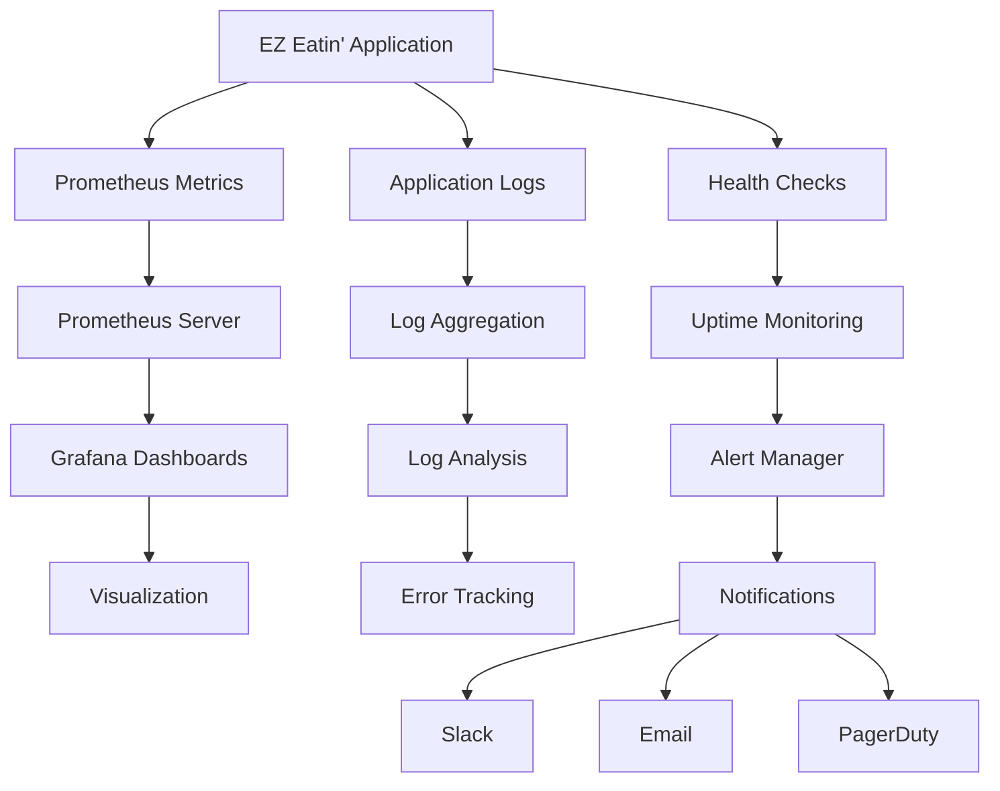

# EZ Eatin' Monitoring and Alerting Configuration

## Overview

This document provides comprehensive monitoring and alerting configurations for the EZ Eatin' application. It includes application performance monitoring, infrastructure monitoring, log aggregation, alerting rules, and dashboard configurations for production environments.

## Table of Contents

1. [Monitoring Architecture](#monitoring-architecture)
2. [Application Monitoring](#application-monitoring)
3. [Infrastructure Monitoring](#infrastructure-monitoring)
4. [Log Management](#log-management)
5. [Alerting Configuration](#alerting-configuration)
6. [Dashboard Configurations](#dashboard-configurations)
7. [Health Check Endpoints](#health-check-endpoints)
8. [Performance Metrics](#performance-metrics)

---

## Monitoring Architecture

### Monitoring Stack Overview



### Components

1. **Prometheus**: Metrics collection and storage
2. **Grafana**: Visualization and dashboards
3. **AlertManager**: Alert routing and notifications
4. **Loki**: Log aggregation (optional)
5. **Uptime Robot**: External uptime monitoring
6. **Sentry**: Error tracking and performance monitoring

---

## Application Monitoring

### 1. Backend Monitoring Configuration

#### Prometheus Metrics Configuration (`monitoring/prometheus.yml`)

```yaml
# Prometheus Configuration for EZ Eatin'
global:
  scrape_interval: 15s
  evaluation_interval: 15s
  external_labels:
    cluster: 'ezeatin-production'
    replica: 'prometheus-1'

rule_files:
  - "alert_rules.yml"
  - "recording_rules.yml"

alerting:
  alertmanagers:
    - static_configs:
        - targets:
          - alertmanager:9093

scrape_configs:
  # Backend API monitoring
  - job_name: 'ezeatin-backend'
    static_configs:
      - targets: ['backend:8000']
    metrics_path: '/metrics'
    scrape_interval: 10s
    scrape_timeout: 5s
    honor_labels: true
    params:
      format: ['prometheus']

  # Frontend monitoring (if metrics endpoint available)
  - job_name: 'ezeatin-frontend'
    static_configs:
      - targets: ['frontend:80']
    metrics_path: '/metrics'
    scrape_interval: 30s
    scrape_timeout: 10s

  # Database monitoring (MongoDB Exporter)
  - job_name: 'mongodb'
    static_configs:
      - targets: ['mongodb-exporter:9216']
    scrape_interval: 30s

  # System monitoring (Node Exporter)
  - job_name: 'node-exporter'
    static_configs:
      - targets: ['node-exporter:9100']
    scrape_interval: 15s

  # Render platform monitoring
  - job_name: 'render-services'
    static_configs:
      - targets: ['ezeatin-backend.onrender.com', 'ezeatin-frontend.onrender.com']
    metrics_path: '/healthz'
    scrape_interval: 60s
    scrape_timeout: 30s
```

#### Backend Metrics Implementation (`backend/app/middleware/metrics.py`)

```python
"""
Prometheus metrics middleware for FastAPI backend
"""
from prometheus_client import Counter, Histogram, Gauge, generate_latest
from prometheus_client.core import CollectorRegistry
from fastapi import Request, Response
from fastapi.responses import PlainTextResponse
import time
import psutil
import asyncio
from typing import Callable

# Create custom registry
REGISTRY = CollectorRegistry()

# HTTP Metrics
http_requests_total = Counter(
    'http_requests_total',
    'Total HTTP requests',
    ['method', 'endpoint', 'status_code'],
    registry=REGISTRY
)

http_request_duration_seconds = Histogram(
    'http_request_duration_seconds',
    'HTTP request duration in seconds',
    ['method', 'endpoint'],
    registry=REGISTRY
)

http_requests_in_progress = Gauge(
    'http_requests_in_progress',
    'HTTP requests currently being processed',
    registry=REGISTRY
)

# Application Metrics
database_connections_active = Gauge(
    'database_connections_active',
    'Active database connections',
    registry=REGISTRY
)

database_query_duration_seconds = Histogram(
    'database_query_duration_seconds',
    'Database query duration in seconds',
    ['collection', 'operation'],
    registry=REGISTRY
)

user_registrations_total = Counter(
    'user_registrations_total',
    'Total user registrations',
    registry=REGISTRY
)

pantry_items_total = Gauge(
    'pantry_items_total',
    'Total pantry items in system',
    registry=REGISTRY
)

recipes_created_total = Counter(
    'recipes_created_total',
    'Total recipes created',
    registry=REGISTRY
)

# System Metrics
system_memory_usage_bytes = Gauge(
    'system_memory_usage_bytes',
    'System memory usage in bytes',
    registry=REGISTRY
)

system_cpu_usage_percent = Gauge(
    'system_cpu_usage_percent',
    'System CPU usage percentage',
    registry=REGISTRY
)

# Error Metrics
application_errors_total = Counter(
    'application_errors_total',
    'Total application errors',
    ['error_type', 'endpoint'],
    registry=REGISTRY
)

class MetricsMiddleware:
    def __init__(self, app):
        self.app = app
        # Start background task to update system metrics
        asyncio.create_task(self.update_system_metrics())
    
    async def __call__(self, scope, receive, send):
        if scope["type"] != "http":
            await self.app(scope, receive, send)
            return
        
        request = Request(scope, receive)
        
        # Skip metrics endpoint to avoid recursion
        if request.url.path == "/metrics":
            await self.app(scope, receive, send)
            return
        
        # Track request in progress
        http_requests_in_progress.inc()
        start_time = time.time()
        
        try:
            # Process request
            response = await self.app(scope, receive, send)
            
            # Record metrics
            duration = time.time() - start_time
            method = request.method
            endpoint = request.url.path
            status_code = getattr(response, 'status_code', 200)
            
            http_requests_total.labels(
                method=method,
                endpoint=endpoint,
                status_code=status_code
            ).inc()
            
            http_request_duration_seconds.labels(
                method=method,
                endpoint=endpoint
            ).observe(duration)
            
        except Exception as e:
            # Record error
            application_errors_total.labels(
                error_type=type(e).__name__,
                endpoint=request.url.path
            ).inc()
            raise
        finally:
            http_requests_in_progress.dec()
    
    async def update_system_metrics(self):
        """Update system metrics periodically"""
        while True:
            try:
                # Memory usage
                memory = psutil.virtual_memory()
                system_memory_usage_bytes.set(memory.used)
                
                # CPU usage
                cpu_percent = psutil.cpu_percent(interval=1)
                system_cpu_usage_percent.set(cpu_percent)
                
                await asyncio.sleep(30)  # Update every 30 seconds
            except Exception as e:
                print(f"Error updating system metrics: {e}")
                await asyncio.sleep(60)

async def metrics_endpoint():
    """Prometheus metrics endpoint"""
    return PlainTextResponse(
        generate_latest(REGISTRY),
        media_type="text/plain"
    )

# Database metrics helper
def record_database_query(collection: str, operation: str, duration: float):
    """Record database query metrics"""
    database_query_duration_seconds.labels(
        collection=collection,
        operation=operation
    ).observe(duration)

# Business metrics helpers
def record_user_registration():
    """Record user registration"""
    user_registrations_total.inc()

def record_recipe_creation():
    """Record recipe creation"""
    recipes_created_total.inc()

def update_pantry_items_count(count: int):
    """Update pantry items count"""
    pantry_items_total.set(count)
```

#### Alert Rules Configuration (`monitoring/alert_rules.yml`)

```yaml
# EZ Eatin' Prometheus Alert Rules
groups:
  - name: ezeatin.rules
    rules:
      # High-level service availability
      - alert: ServiceDown
        expr: up == 0
        for: 1m
        labels:
          severity: critical
        annotations:
          summary: "Service {{ $labels.instance }} is down"
          description: "{{ $labels.instance }} has been down for more than 1 minute."

      - alert: HighErrorRate
        expr: rate(http_requests_total{status_code=~"5.."}[5m]) > 0.1
        for: 2m
        labels:
          severity: critical
        annotations:
          summary: "High error rate on {{ $labels.instance }}"
          description: "Error rate is {{ $value }} errors per second on {{ $labels.instance }}"

      # Response time alerts
      - alert: HighResponseTime
        expr: histogram_quantile(0.95, rate(http_request_duration_seconds_bucket[5m])) > 2
        for: 5m
        labels:
          severity: warning
        annotations:
          summary: "High response time on {{ $labels.instance }}"
          description: "95th percentile response time is {{ $value }}s on {{ $labels.instance }}"

      - alert: VeryHighResponseTime
        expr: histogram_quantile(0.95, rate(http_request_duration_seconds_bucket[5m])) > 5
        for: 2m
        labels:
          severity: critical
        annotations:
          summary: "Very high response time on {{ $labels.instance }}"
          description: "95th percentile response time is {{ $value }}s on {{ $labels.instance }}"

      # Database alerts
      - alert: DatabaseConnectionsHigh
        expr: database_connections_active > 80
        for: 5m
        labels:
          severity: warning
        annotations:
          summary: "High database connections"
          description: "Database has {{ $value }} active connections"

      - alert: DatabaseQuerySlow
        expr: histogram_quantile(0.95, rate(database_query_duration_seconds_bucket[5m])) > 1
        for: 5m
        labels:
          severity: warning
        annotations:
          summary: "Slow database queries"
          description: "95th percentile database query time is {{ $value }}s"

      # System resource alerts
      - alert: HighMemoryUsage
        expr: (system_memory_usage_bytes / (1024^3)) > 1.5  # 1.5GB
        for: 5m
        labels:
          severity: warning
        annotations:
          summary: "High memory usage"
          description: "Memory usage is {{ $value }}GB"

      - alert: HighCPUUsage
        expr: system_cpu_usage_percent > 80
        for: 5m
        labels:
          severity: warning
        annotations:
          summary: "High CPU usage"
          description: "CPU usage is {{ $value }}%"

      # Business logic alerts
      - alert: NoUserRegistrations
        expr: increase(user_registrations_total[1h]) == 0
        for: 2h
        labels:
          severity: warning
        annotations:
          summary: "No user registrations in the last hour"
          description: "There have been no user registrations for 2 hours"

      - alert: HighApplicationErrors
        expr: rate(application_errors_total[5m]) > 0.05
        for: 2m
        labels:
          severity: critical
        annotations:
          summary: "High application error rate"
          description: "Application error rate is {{ $value }} errors per second"

  - name: ezeatin.infrastructure
    rules:
      # Infrastructure monitoring
      - alert: DiskSpaceHigh
        expr: (node_filesystem_avail_bytes / node_filesystem_size_bytes) < 0.1
        for: 5m
        labels:
          severity: warning
        annotations:
          summary: "Low disk space on {{ $labels.instance }}"
          description: "Disk space is {{ $value | humanizePercentage }} full"

      - alert: LoadAverageHigh
        expr: node_load1 > 2
        for: 5m
        labels:
          severity: warning
        annotations:
          summary: "High load average on {{ $labels.instance }}"
          description: "Load average is {{ $value }}"
```

### 2. Frontend Monitoring Configuration

#### Frontend Performance Monitoring (`frontend/src/lib/monitoring.ts`)

```typescript
/**
 * Frontend monitoring and analytics
 */

interface PerformanceMetric {
  name: string;
  value: number;
  timestamp: number;
  labels?: Record<string, string>;
}

interface ErrorReport {
  message: string;
  stack?: string;
  url: string;
  timestamp: number;
  userAgent: string;
  userId?: string;
}

class FrontendMonitoring {
  private apiEndpoint: string;
  private enabled: boolean;
  private metrics: PerformanceMetric[] = [];
  private errors: ErrorReport[] = [];

  constructor(apiEndpoint: string, enabled: boolean = true) {
    this.apiEndpoint = apiEndpoint;
    this.enabled = enabled;
    
    if (this.enabled) {
      this.setupErrorHandling();
      this.setupPerformanceObserver();
      this.startMetricsCollection();
    }
  }

  private setupErrorHandling() {
    // Global error handler
    window.addEventListener('error', (event) => {
      this.recordError({
        message: event.message,
        stack: event.error?.stack,
        url: event.filename || window.location.href,
        timestamp: Date.now(),
        userAgent: navigator.userAgent
      });
    });

    // Unhandled promise rejection handler
    window.addEventListener('unhandledrejection', (event) => {
      this.recordError({
        message: `Unhandled Promise Rejection: ${event.reason}`,
        url: window.location.href,
        timestamp: Date.now(),
        userAgent: navigator.userAgent
      });
    });
  }

  private setupPerformanceObserver() {
    if ('PerformanceObserver' in window) {
      // Navigation timing
      const navObserver = new PerformanceObserver((list) => {
        for (const entry of list.getEntries()) {
          if (entry.entryType === 'navigation') {
            const navEntry = entry as PerformanceNavigationTiming;
            this.recordMetric('page_load_time', navEntry.loadEventEnd - navEntry.fetchStart);
            this.recordMetric('dom_content_loaded', navEntry.domContentLoadedEventEnd - navEntry.fetchStart);
            this.recordMetric('first_byte_time', navEntry.responseStart - navEntry.fetchStart);
          }
        }
      });
      navObserver.observe({ entryTypes: ['navigation'] });

      // Resource timing
      const resourceObserver = new PerformanceObserver((list) => {
        for (const entry of list.getEntries()) {
          if (entry.entryType === 'resource') {
            const resourceEntry = entry as PerformanceResourceTiming;
            this.recordMetric('resource_load_time', resourceEntry.responseEnd - resourceEntry.fetchStart, {
              resource_type: resourceEntry.initiatorType,
              resource_name: resourceEntry.name
            });
          }
        }
      });
      resourceObserver.observe({ entryTypes: ['resource'] });

      // Largest Contentful Paint
      const lcpObserver = new PerformanceObserver((list) => {
        for (const entry of list.getEntries()) {
          this.recordMetric('largest_contentful_paint', entry.startTime);
        }
      });
      lcpObserver.observe({ entryTypes: ['largest-contentful-paint'] });

      // First Input Delay
      const fidObserver = new PerformanceObserver((list) => {
        for (const entry of list.getEntries()) {
          this.recordMetric('first_input_delay', entry.processingStart - entry.startTime);
        }
      });
      fidObserver.observe({ entryTypes: ['first-input'] });
    }
  }

  private startMetricsCollection() {
    // Send metrics every 30 seconds
    setInterval(() => {
      this.sendMetrics();
    }, 30000);

    // Send errors immediately
    setInterval(() => {
      this.sendErrors();
    }, 5000);
  }

  recordMetric(name: string, value: number, labels?: Record<string, string>) {
    if (!this.enabled) return;

    this.metrics.push({
      name,
      value,
      timestamp: Date.now(),
      labels
    });
  }

  recordError(error: ErrorReport) {
    if (!this.enabled) return;

    this.errors.push(error);
    console.error('Frontend Error:', error);
  }

  recordUserAction(action: string, details?: Record<string, any>) {
    this.recordMetric('user_action', 1, {
      action,
      ...details
    });
  }

  recordAPICall(endpoint: string, method: string, duration: number, status: number) {
    this.recordMetric('api_call_duration', duration, {
      endpoint,
      method,
      status: status.toString()
    });
  }

  private async sendMetrics() {
    if (this.metrics.length === 0) return;

    try {
      await fetch(`${this.apiEndpoint}/api/v1/metrics/frontend`, {
        method: 'POST',
        headers: {
          'Content-Type': 'application/json'
        },
        body: JSON.stringify({
          metrics: this.metrics,
          timestamp: Date.now(),
          url: window.location.href,
          userAgent: navigator.userAgent
        })
      });

      this.metrics = [];
    } catch (error) {
      console.error('Failed to send metrics:', error);
    }
  }

  private async sendErrors() {
    if (this.errors.length === 0) return;

    try {
      await fetch(`${this.apiEndpoint}/api/v1/errors/frontend`, {
        method: 'POST',
        headers: {
          'Content-Type': 'application/json'
        },
        body: JSON.stringify({
          errors: this.errors,
          timestamp: Date.now()
        })
      });

      this.errors = [];
    } catch (error) {
      console.error('Failed to send errors:', error);
    }
  }

  // Web Vitals measurement
  measureWebVitals() {
    // Cumulative Layout Shift
    let clsValue = 0;
    let clsEntries: PerformanceEntry[] = [];

    const observer = new PerformanceObserver((list) => {
      for (const entry of list.getEntries()) {
        if (!entry.hadRecentInput) {
          clsValue += (entry as any).value;
          clsEntries.push(entry);
        }
      }
    });

    observer.observe({ entryTypes: ['layout-shift'] });

    // Report CLS when page becomes hidden
    document.addEventListener('visibilitychange', () => {
      if (document.visibilityState === 'hidden') {
        this.recordMetric('cumulative_layout_shift', clsValue);
      }
    });
  }
}

// Initialize monitoring
const monitoring = new FrontendMonitoring(
  import.meta.env.VITE_API_BASE_URL,
  import.meta.env.VITE_APP_ENV === 'production'
);

// Export for use in components
export default monitoring;

// Helper functions for React components
export const recordPageView = (pageName: string) => {
  monitoring.recordUserAction('page_view', { page: pageName });
};

export const recordButtonClick = (buttonName: string, location: string) => {
  monitoring.recordUserAction('button_click', { button: buttonName, location });
};

export const recordFormSubmission = (formName: string, success: boolean) => {
  monitoring.recordUserAction('form_submission', { form: formName, success });
};

export const recordAPIError = (endpoint: string, error: string) => {
  monitoring.recordError({
    message: `API Error: ${error}`,
    url: window.location.href,
    timestamp: Date.now(),
    userAgent: navigator.userAgent
  });
};
```

---

## Infrastructure Monitoring

### 1. AlertManager Configuration (`monitoring/alertmanager.yml`)

```yaml
# AlertManager Configuration
global:
  smtp_smarthost: 'smtp.gmail.com:587'
  smtp_from: 'alerts@ezeatin.com'
  smtp_auth_username: 'alerts@ezeatin.com'
  smtp_auth_password: 'your-app-password'

route:
  group_by: ['alertname', 'cluster', 'service']
  group_wait: 10s
  group_interval: 10s
  repeat_interval: 1h
  receiver: 'default'
  routes:
    - match:
        severity: critical
      receiver: 'critical-alerts'
      group_wait: 0s
      repeat_interval: 5m
    - match:
        severity: warning
      receiver: 'warning-alerts'
      repeat_interval: 30m

receivers:
  - name: 'default'
    slack_configs:
      - api_url: 'YOUR_SLACK_WEBHOOK_URL'
        channel: '#alerts'
        title: 'EZ Eatin Alert'
        text: '{{ range .Alerts }}{{ .Annotations.summary }}{{ end }}'

  - name: 'critical-alerts'
    slack_configs:
      - api_url: 'YOUR_SLACK_WEBHOOK_URL'
        channel: '#critical-alerts'
        title: '🚨 CRITICAL: EZ Eatin Alert'
        text: '{{ range .Alerts }}{{ .Annotations.summary }}\n{{ .Annotations.description }}{{ end }}'
        send_resolved: true
    email_configs:
      - to: 'team@ezeatin.com'
        subject: '🚨 CRITICAL Alert: {{ .GroupLabels.alertname }}'
        body: |
          {{ range .Alerts }}
          Alert: {{ .Annotations.summary }}
          Description: {{ .Annotations.description }}
          Severity: {{ .Labels.severity }}
          Instance: {{ .Labels.instance }}
          Time: {{ .StartsAt }}
          {{ end }}
    pagerduty_configs:
      - routing_key: 'YOUR_PAGERDUTY_INTEGRATION_KEY'
        description: '{{ .GroupLabels.alertname }}: {{ .GroupLabels.instance }}'

  - name: 'warning-alerts'
    slack_configs:
      - api_url: 'YOUR_SLACK_WEBHOOK_URL'
        channel: '#warnings'
        title: '⚠️ WARNING: EZ Eatin Alert'
        text: '{{ range .Alerts }}{{ .Annotations.summary }}{{ end }}'

inhibit_rules:
  - source_match:
      severity: 'critical'
    target_match:
      severity: 'warning'
    equal: ['alertname', 'instance']
```

### 2. Grafana Dashboard Configuration

#### Main Application Dashboard (`monitoring/dashboards/ezeatin-overview.json`)

```json
{
  "dashboard": {
    "id": null,
    "title": "EZ Eatin' - Application Overview",
    "tags": ["ezeatin", "overview"],
    "timezone": "browser",
    "panels": [
      {
        "id": 1,
        "title": "Service Status",
        "type": "stat",
        "targets": [
          {
            "expr": "up{job=\"ezeatin-backend\"}",
            "legendFormat": "Backend"
          },
          {
            "expr": "up{job=\"ezeatin-frontend\"}",
            "legendFormat": "Frontend"
          }
        ],
        "fieldConfig": {
          "defaults": {
            "color": {
              "mode": "thresholds"
            },
            "thresholds": {
              "steps": [
                {"color": "red", "value": 0},
                {"color": "green", "value": 1}
              ]
            }
          }
        }
      },
      {
        "id": 2,
        "title": "Request Rate",
        "type": "graph",
        "targets": [
          {
            "expr": "rate(http_requests_total[5m])",
            "legendFormat": "{{method}} {{endpoint}}"
          }
        ]
      },
      {
        "id": 3,
        "title": "Response Time (95th percentile)",
        "type": "graph",
        "targets": [
          {
            "expr": "histogram_quantile(0.95, rate(http_request_duration_seconds_bucket[5m]))",
            "legendFormat": "95th percentile"
          }
        ]
      },
      {
        "id": 4,
        "title": "Error Rate",
        "type": "graph",
        "targets": [
          {
            "expr": "rate(http_requests_total{status_code=~\"5..\"}[5m])",
            "legendFormat": "5xx errors"
          },
          {
            "expr": "rate(http_requests_total{status_code=~\"4..\"}[5m])",
            "legendFormat": "4xx errors"
          }
        ]
      },
      {
        "id": 5,
        "title": "Active Users",
        "type": "stat",
        "targets": [
          {
            "expr": "user_registrations_total",
            "legendFormat": "Total Registrations"
          }
        ]
      },
      {
        "id": 6,
        "title": "Database Performance",
        "type": "graph",
        "targets": [
          {
            "expr": "histogram_quantile(0.95, rate(database_query_duration_seconds_bucket[5m]))",
            "legendFormat": "Query Time (95th)"
          },
          {
            "expr": "database_connections_active",
            "legendFormat": "Active Connections"
          }
        ]
      },
      {
        "id": 7,
        "title": "System Resources",
        "type": "graph",
        "targets": [
          {
            "expr": "system_cpu_usage_percent",
            "legendFormat": "CPU Usage %"
          },
          {
            "expr": "system_memory_usage_bytes / (1024^3)",
            "legendFormat": "Memory Usage (GB)"
          }
        ]
      },
      {
        "id": 8,
        "title": "Business Metrics",
        "type": "stat",
        "targets": [
          {
            "expr": "pantry_items_total",
            "legendFormat": "Total Pantry Items"
          },
          {
            "expr": "recipes_created_total",
            "legendFormat": "Total Recipes"
          }
        ]
      }
    ],
    "time": {
      "from": "now-1h",
      "to": "now"
    },
    "refresh": "30s"
  }
}
```

---

## Log Management

### 1. Structured Logging Configuration

#### Backend Logging (`backend/app/utils/logging.py`)

```python
"""
Structured logging configuration for EZ Eatin' backend
"""
import logging
import json
import sys
from datetime import datetime
from typing import Any, Dict
from contextvars import ContextVar
from fastapi import Request

# Context variables for request tracking
request_id_var: ContextVar[str] = ContextVar('request_id', default='')
user_id_var: ContextVar[str] = ContextVar('user_id', default='')

class StructuredFormatter(logging.Formatter):
    """Custom formatter for structured JSON logging"""
    
    def format(self, record: logging.LogRecord) -> str:
        log_entry = {
            'timestamp': datetime.utcnow().isoformat() + 'Z',
            'level': record.levelname,
            'logger': record.name,
            'message': record.getMessage(),
            'module': record.module,
            'function': record.funcName,
            'line': record.lineno,
        }
        
        # Add request context if available
        request_id = request_id_var.get('')
        if request_id:
            log_entry['request_id'] = request_id
        
        user_id = user_id_var.get('')
        if user_id:
            log_entry['user_id'] = user_id
        
        # Add exception info if present
        if record.exc_info:
            log_entry['exception'] = self.formatException(record.exc_info)
        
        # Add extra fields
        if hasattr(record, 'extra'):
            log_entry.update(record.extra)
        
        return json.dumps(log_entry)

def setup_logging(log_level: str = "INFO", log_file: str = None):
    """Setup structured logging configuration"""
    
    # Create formatter
    formatter = StructuredFormatter()
    
    # Setup console handler
    console_handler = logging.StreamHandler(sys.stdout)
    console_handler.setFormatter(formatter)
    
    # Setup file handler if specified
    handlers = [console_handler]
    if log_file:
        file_handler = logging.FileHandler(log_file)
        file_handler.setFormatter(formatter)
        handlers.append(file_handler)
    
    # Configure root logger
    logging.basicConfig(
        level=getattr(logging, log_level.upper()),
        handlers=handlers,
        format='%(message)s'
    )
    
    # Suppress noisy loggers
    logging.getLogger('uvicorn.access').setLevel(logging.WARNING)
    logging.getLogger('motor').setLevel(logging.WARNING)

def get_logger(name: str) -> logging.Logger:
    """Get a logger with the specified name"""
    return logging.getLogger(name)

def log_request_start(request: Request, request_id: str):
    """Log request start with context"""
    request_id_var.set(request_id)
    
    logger = get_logger('ezeatin.request')
    logger.info(
        "Request started",
        extra={
            'method': request.method,
            'url': str(request.url),
            'headers': dict(request.headers),
            'client_ip': request.client.host if request.client else None
        }
    )

def log_request_end(request: Request, response_status: int, duration: float):
    """Log request completion"""
    logger = get_logger('ezeatin.request')
    logger.info(
        "Request completed",
        extra={
            'method': request.method,
            'url': str(request.url),
            'status_code': response_status,
            'duration_ms': round(duration * 1000, 2)
        }
    )

def log_database_operation(collection: